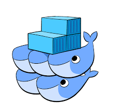
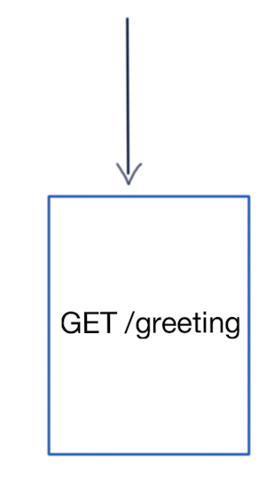
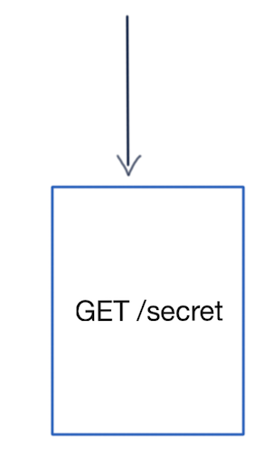

title: TDD for Containers
class: animation-fade
layout: true

<!-- This slide will serve as the base layout for all your slides -->

---

class: impact

# {{title}}


---

class: impact

.col-4[
## What?
]

.col-4[
## Why?
]

.col-4[
## How?
]

???

- Goal: Help you get started testing your infra


---

class: impact center middle

## Mario Fernandez
 Lead Developer
 
 
 **Thought**Works

---

## .bubble[Nov 17] Tech Radar

--

> Many development teams have adopted *test-driven development* practices for writing application code because of their benefits. 

--

<hr />
> Others have turned to *containers* to package and deploy their software, and it's accepted practice to use automated scripts to build the containers.

--

<hr />
> What we’ve seen few teams do so far is combine the two trends and drive the writing of the container scripts using tests.

---

class: middle center


???

- Who claims to do TDD here?
- Who actually _practices_ TDD?

---

class: center middle

## Not much left to say about TDD

---

class: middle center


---

class: center middle

## Path to Production

---

class: full-width
background-image: url(images/sample-pipeline.png)

---

class: center middle

## Containers make moving through integration stages effortless

---

class: center middle

.image-grid[
.img[]
.img[]
.img[]
.img[]
]

---

class: transition

# My first experience with Docker

---

class: middle

# Setup
## 8+ years old Ruby monolith

---

class: middle

# Job to be done
## Package the app as a container
## Would run in a VM as a sandbox

---

# How it went

--

.menu[
- .item[Try something]
- .item[Wait 40+ mins]
- .item[Did not work]
- .item[I don't know what I'm doing]
- .item[Despair]
- .item[Consider career choice]
]

---

# How it went

## Multiple months of work
## Flaky, hard to change
## Path to production didn't even reach production

---

class: center middle


---

class: transition

## There has to be a better way

---

class: center middle

## Fast feedback and automation are crucial

---

class: center middle

## Use the right tools

---

class: center middle


---

class: center middle

## Write RSpec tests for infrastructure

---

class: transition 

# Let's containerize an app
## Now with a lot less pain

---

class: center middle

.col-6[
.spring[

]
]
.col-6[

]

???

- spring boot application with one route (/greeting), JAR already built

---

### Init

```ruby
require 'serverspec'
require 'docker'
require 'rspec/wait'

set :backend, :docker
set :docker_image, 'example-openjdk'

RSpec.configure do |config|
  config.wait_timeout = 60 # seconds
end
```

---

### OS Version

```ruby
describe file('/etc/alpine-release') do
  its(:content) { is_expected.to match(/3.8.2/) }
end
```

---

### OS Version

```Dockerfile
FROM alpine:3.8
```

---

### Java Version

```ruby
describe command('java -version') do
  its(:stderr) { is_expected.to match(/1.8.0_181/) }
end
```

---

### Java Version

```Dockerfile
FROM openjdk:8-jre-alpine3.8
```

---

### JAR

```ruby
describe file('gs-rest-service.jar') do
  it { is_expected.to be_file }
end
```

---

### JAR

```Dockerfile
FROM openjdk:8-jre-alpine3.8

WORKDIR /app
ENV VERSION="0.1.0"

COPY build/libs/gs-rest-service-${VERSION}.jar .
```

---

### App is running

```ruby
describe process('java') do
  it { is_expected.to be_running }
  its(:args) { is_expected.to contain('gs-rest-service.jar') }
end
```

---

### App is running

```Dockerfile
FROM openjdk:8-jre-alpine3.8

WORKDIR /app
ENV VERSION="0.1.0"

COPY build/libs/gs-rest-service-${VERSION}.jar gs-rest-service.jar

CMD ["java", "-jar", "gs-rest-service.jar"]
```

---

### Bound to right port

```ruby
describe 'listens to correct port' do
  it { wait_for(port(8080)).to be_listening.with('tcp') }
end
```

---

### Bound to right port

```Dockerfile
FROM openjdk:8-jre-alpine3.8

WORKDIR /app
EXPOSE 8080
ENV VERSION="0.1.0"

COPY build/libs/gs-rest-service-${VERSION}.jar gs-rest-service.jar

CMD ["java", "-jar", "gs-rest-service.jar"]
```

---

### Not running under root

```ruby
describe process('java') do
  its(:user) { is_expected.to eq('runner') }
end
```

---

### Not running under root

```Dockerfile
FROM openjdk:8-jre-alpine3.8

WORKDIR /app
EXPOSE 8080
ENV VERSION="0.1.0"

COPY build/libs/gs-rest-service-${VERSION}.jar gs-rest-service.jar

RUN adduser -D runner

USER runner
CMD ["java", "-jar", "gs-rest-service.jar"]
```

---

# Did the tests pass?

--

## Hell yes!

--

## Cool, let's run them on every commit now

---

class: full-width
background-image: url(images/pipeline.png)

???

- offtopic: Running dind in a pipeline is tricky
- links at the end for examples

---

class: center middle

## Code
### https://github.com/sirech/talk-tdd-infra-redux/tree/master/code

---

class: transition

# This is but a start

---

class: center middle

.col-6[

]
.col-6[

]

---

## Access secret

```ruby
describe 'fetches a secret' do
  it { wait_for(secret).to match(/the_secret/) }
end

private

def secret
  command('curl localhost:3000/secret').stdout
end
```

---

## Access secret

```javascript
app.get('/secret', 
  (req, res) => 
    res.send(`The super secret value is ${process.env.SECRET}`))
```

---

class: center middle


---

## Injected at runtime

```ruby
describe file('/usr/sbin/entrypoint.sh') do
  it { is_expected.to be_file }
end
```

---

## Injected at runtime


```bash
#!/usr/bin/env bash

set -e

secret=$(
  aws --region "${AWS_REGION}" \
  secretsmanager get-secret-value \
  --secret-id "${SECRET_KEY}" \
  | jq -r .SecretString)
export SECRET="$secret"

exec "$@"
```

---

## Injected at runtime

```Dockerfile
FROM node:11.6-alpine

# ... install awscli
# ... node dependencies
# ... copy app

COPY entrypoint.sh /usr/sbin/entrypoint.sh

RUN adduser -D runner

USER runner
SHELL ["/bin/bash", "-o", "pipefail", "-c"]
ENTRYPOINT ["/usr/sbin/entrypoint.sh"]
CMD ["node", "app.js"]
```

---

class: center middle

## How to make the tests run now?

---

class: middle center

.col-6[


## Localstack
]

.col-6[

]

---

## Dependency setup

```yaml
version: '3'
services:
  localstack:
    container_name: localstack
    image: localstack/localstack

    ports:
      - "4584:4584"

    environment:
      - DEFAULT_REGION=eu-central-1
      - SERVICES=secretsmanager
      
  ...
```

---

## Dependency setup

```yaml
  app:
    container_name: app
    build: ./app

    ports:
      - "3000:3000"

    env_file: .env

    links:
      - localstack
```

---

## Dependency setup

```ruby
require 'docker/compose'
set :docker_container, 'app'

RSpec.configure do |config|
  compose = Docker::Compose.new

  config.before(:all) { compose.up(detached: true, build: true) }

  config.after(:all) do
    compose.kill
    compose.rm(force: true)
  end
end
```

---

## That's a lot of *TDD*

```console
  Container File "/usr/sbin/entrypoint.sh" should be file
    1.28 seconds ./spec/container_spec.rb:29
  Container fetches a secret from ASM should match /localstack_secret/
    0.13081 seconds ./spec/container_spec.rb:33

2 examples, 0 failures
```

---

class: center middle

## Code
### https://github.com/sirech/example-serverspec-aws

---

class: transition

# Are you convinced now?

---

# Summary

## High quality containers are an important part of delivering software
## A quick feedback cycle is possible with meaningful tests

--

## This can be accomplished doing TDD


---

# Links

- _ServerSpec_ resource types: https://serverspec.org/resource_types.html
- https://www.thoughtworks.com/insights/blog/modernizing-your-build-pipelines
- Integrate _ServerSpec_ in _Concourse_: https://github.com/sirech/example-concourse-pipeline
- Container example: https://github.com/sirech/talk-tdd-infra-redux/tree/master/code
- Dependencies example: https://github.com/sirech/example-serverspec-aws

---


